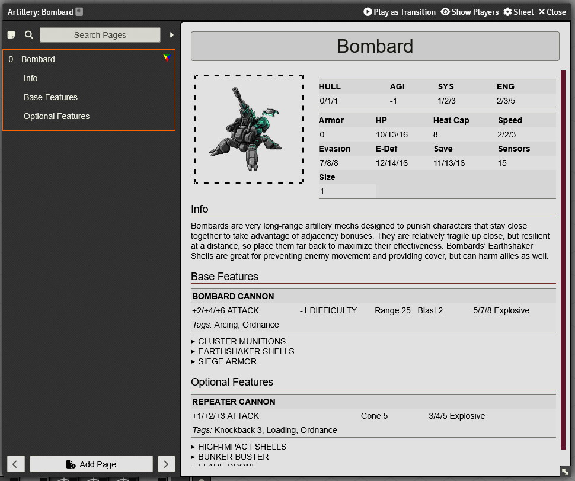
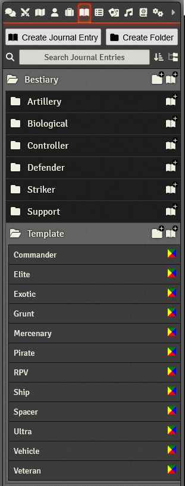
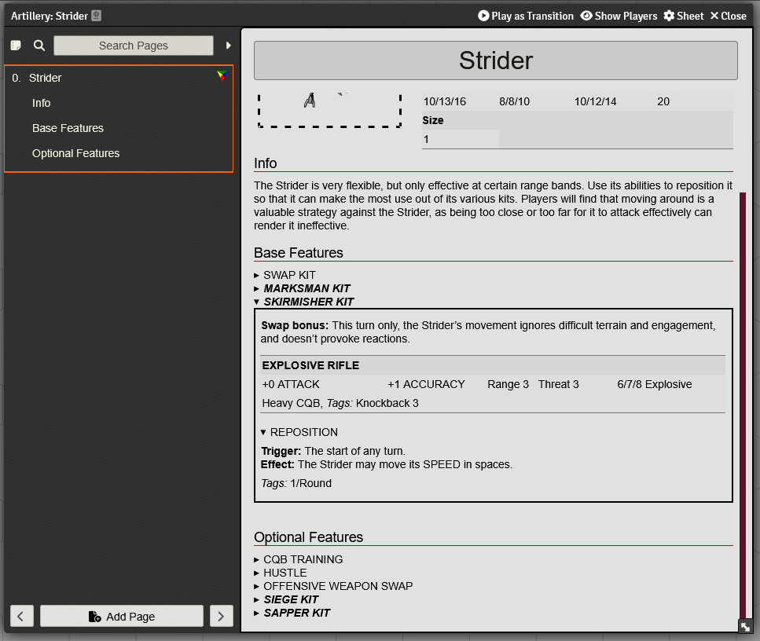

# Ceres et al.'s Lancer Macros

This is a collection of the macros I've written to help me run [Lancer](https://massif-press.itch.io/corebook-pdf-free) on [FoundryVTT](https://foundryvtt.com/).

Unless indicated otherwise, these have been tested on Foundry v12.331, Lancer v2.8.1.

This is _not_ a Foundry module! To add each macro to your game, you'll need to create new script macros in your world and copy-paste the code in. Detailed information is included at the top of each macro, including settings if applicable.

These macros (and this repo) owe a lot to [LostCarcosa and Z3nner's macros](https://github.com/LostCarcosa/Carcosas-Lancer-Macros/). Check them out!

A list includes:

## [Lancer Bestiary](lancer_bestiary.js)

Creates a comprehensive bestiary of NPC classes and templates for all loaded LCPs, intelligently sorted into subfolders based on role (Artillery, Striker), etc. Includes special handling for Striders for No Room for a Wallflower (see screenshots section) and is compatible with all kinds of third-party content, including out-of-the-box support for Kai Tave's NPC rebakes that are currently in playtesting.

Screenshots

  

  *(Screenshot taken with [Ownership Viewer](https://foundryvtt.com/packages/permission_viewer))*

  

  

### Changelog

#### May 16, 2025
* Indev version of a Black Thumb macro. It's here for version controlling, but you should only mess with it if you're okay with potential world-breaking bugs.
* **Lancer Bestiary 0.2**
	* Striders now group together their kit features. I'm not super happy with the solution I used, but it'll work for now.
	* NPC weapon types (i.e. Superheavy Cannon) are displayed alongside their tags.
	* Minor adjustment to console logging to improve legibility -- now prefixes "[MACRO]" instead of "Macro:".
	* Updated to use Foundry's new dialog system, since the old one was deprecated.

#### May 9, 2025
* Initial release.
